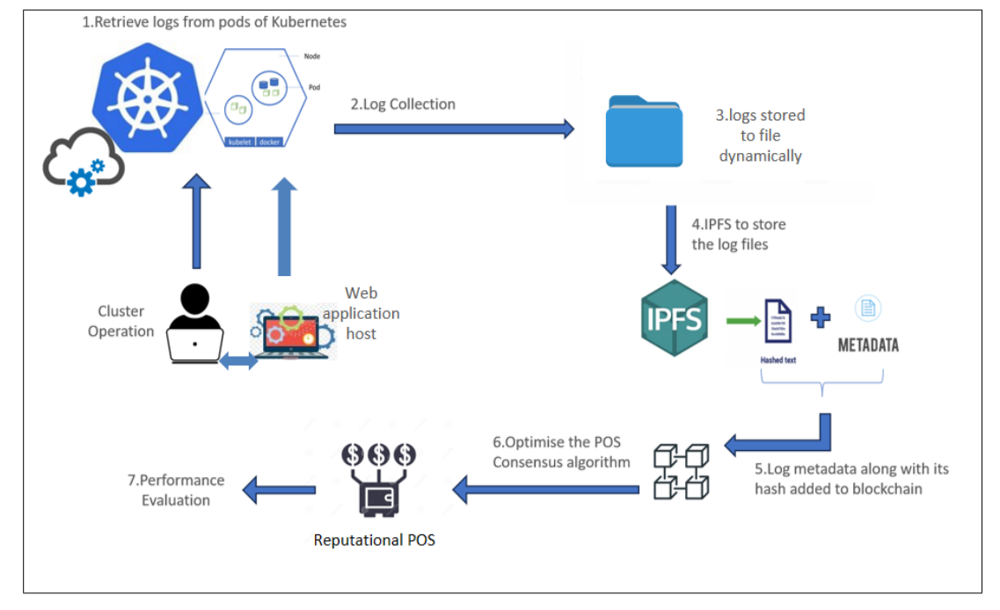
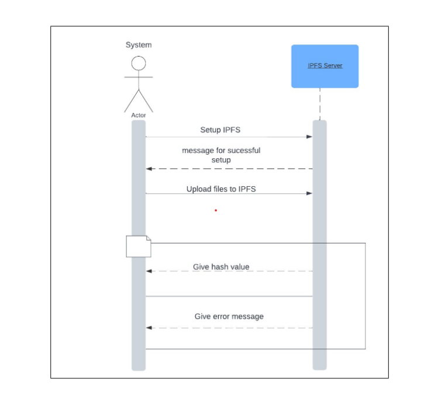

# Cloud Forensics Using Blockchain

## Project Overview

Cloud Forensics ensures the preservation of evidence integrity,authenticity and privacy while meeting legal and regulatory requirements,making it valuable tool for organizations facing cloud related security incidents and investigations.Retrieving the log files from CSP and maintaining a secure and separate applications or database for storing logs and adding hash values to the blockchain.IPFS is utilized to generate a unique hash value for each file, which is then stored on the Ethereum blockchain.

## Objectives

- **Data Provenance Assurance:** Develop a framework for data provenance assurance in a cloud environment by integrating Ethereum Blockchain and IPFS.
- **Optimized Consensus Algorithm:** Design an optimized consensus algorithm using the go-Ethereum protocol for the blockchain network.
- **Performance Evaluation:** Evaluate the performance of the proposed algorithm against existing algorithms in various scenarios, focusing on efficiency and scalability.

## Functional Requirements

1. The system shall collect web logs from a sample application hosted on the Kubernetes cluster.
2. Logs are securely stored across the IPFS network, ensuring decentralized and distributed storage.
3. The system shall provide a unique IPFS-generated hash for each set of logs.
4. Each hash value and corresponding metadata are stored in the blockchain, ensuring transparency and immutability.
5. The system shall guarantee tamper-proof log data storage in the blockchain via IPFS.
6. Efficient search and retrieval mechanisms enable users to query logs stored in the blockchain via IPFS.
7. The system shall incorporate an improvisation of the Proof-of-Stake (POS) algorithm to the Reputation Proof-of-Stake (RPOS) algorithm.

## Non-Functional Requirements

- System shall provide log retrieval within a specified timeframe, considering the varying
volume of logs and the complexity of queries.
- System shall implement end-to-end encryption for log data during transmission and
storage, ensuring the protection of sensitive information. Evaluation of POS and RPOS
Results.
- System shall evaluate and compare the results of the original POS algorithm and the
optimized RPOS algorithm, providing insights into their respective performances and
efficiencies.

## System Design

()

## Architecture Design

## Future Scope

- **Multi-Cloud Platform:** Extend the data provenance assurance framework to support a multi-cloud platform.
- **Enhanced Scalability:** Further optimize the system to handle larger datasets and more complex scenarios.

## Technologies Used

- **Frontend:** 
- **Smart Contracts:** Solidity
- **Blockchain:** Ethereum (go-Ethereum protocol)
- **File Storage:** IPFS (InterPlanetary File System)

## Getting Started

### Prerequisites

- Node.js
- Solidity Compiler
- IPFS Daemon
- Ethereum Node (e.g., Geth)

